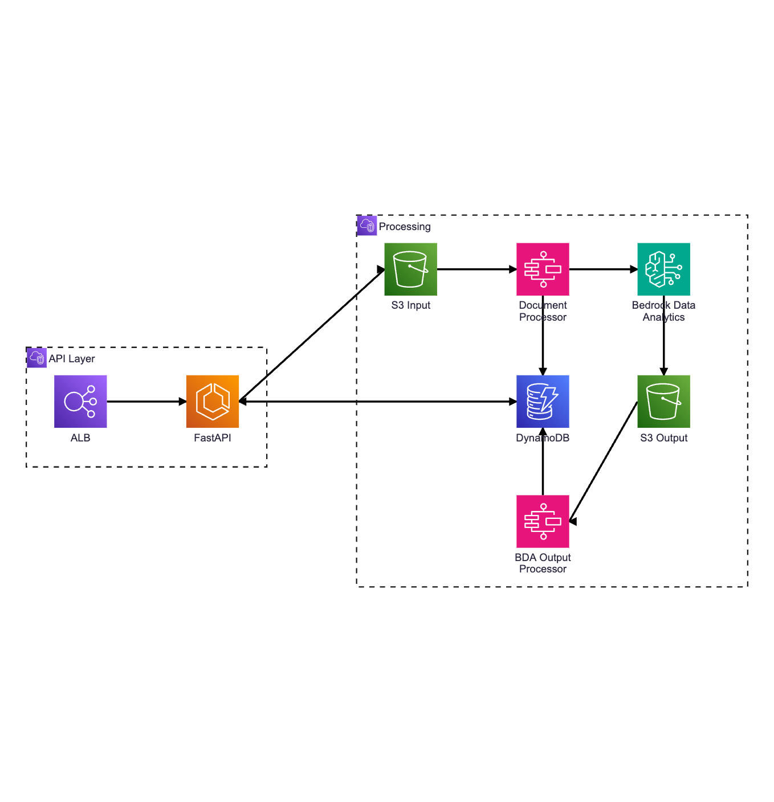

# DocumentAI API

This is the application code for DocumentAI.

## Overview

A document processing system built on AWS that uses Amazon Bedrock Data Automation (BDA) to classify and extract data from uploaded documents.

## Architecture

The system follows an event-driven architecture with two main layers:

- **API Layer** - Document upload and status endpoints  
- **Processing** - Document classification and data extraction pipeline  



**Processing Flow:**
1. A document is uploaded via DocumentAI API endpoint
2. DocumentAI API validates and stores document in S3 bucket
3. S3 event triggers `document_processor` job
4. Document Processor invokes Bedrock Data Automation for classification/extraction
5. BDA outputs results to S3 bucket
6. S3 event triggers `bda_output_processor` job to process results and update DynamoDB

For detailed component descriptions, see [Project Structure](#project-structure).

## Features

- **AWS Bedrock Data Automation (BDA) Integration** - Automated document classification and data extraction
- **Intelligent Document Detection** - Quality analysis, blur detection, and document validation
- **Multi-format Support** - Process PDF, JPEG, PNG, and TIFF documents
- **Event-driven Processing** - S3-triggered pipeline for scalable document processing
- **Testing** - 87% test coverage with unit and integration tests
- **Local Development** - Docker Compose environment for testing without AWS deployment
- **Structured Logging** - Standardized logging across all components
- **DynamoDB Tracking** - Complete processing history and metadata storage

## File Requirements & Limitations

**Supported file formats:**
- PDF
- JPEG
- PNG  
- TIFF

**File size limits:**
- **Images** (JPEG, PNG, TIFF): Maximum 5 MB per file
- **PDF documents**: Maximum 500 MB per file

**PDF page handling:**
- PDFs with more than 5 pages (configurable) are automatically trimmed to the first 5 pages
- Quality checks are performed on the first 5 (configurable) pages only

> **Note:** The 5-page default was chosen for performance optimization. Documents are trimmed rather than rejected to ensure processing can proceed.

**Document requirements:**
- Documents must not be password-protected
- Minimum text content of 50 characters for document detection
- Images must meet minimum quality standards (blur detection threshold applied)


## Prerequisites

- **Python 3.11+** - Required for running the application
- **uv** - Fast Python package installer ([installation guide](https://docs.astral.sh/uv/getting-started/installation/))
- **Docker & Docker Compose** - For local development environment
- **Make** - For running development commands 
- **AWS CLI** (optional) - For interacting with AWS services during development

**For deployment:**
- AWS account with appropriate permissions
- Infrastructure deployed (see [Deployment](#deployment) section)


## Configuration

### Environment Variables

**Required for AWS service integration** (set by infrastructure when deployed):

- `DOCUMENTAI_INPUT_LOCATION` - S3 bucket for document uploads (e.g., `s3://bucket-name`)
- `DOCUMENTAI_OUTPUT_LOCATION` - S3 bucket for BDA processing results
- `DOCUMENTAI_DOCUMENT_METADATA_TABLE_NAME` - DynamoDB table for tracking document processing
- `BDA_PROJECT_ARN` - AWS Bedrock Data Automation project ARN
- `BDA_PROFILE_ARN` - AWS Bedrock Data Automation profile ARN
- `BDA_REGION` - AWS region for BDA service
- `API_AUTH_INSECURE_SHARED_KEY` - API authentication key (see [API Authentication](../docs/app-documentai/api-authentication.md))


**Optional for local development:**

- `HOST` - API host (default: `localhost`)
- `PORT` - API port (default: `3500`)
- `ENVIRONMENT` - Environment name (e.g., `dev`, `prod`, `local`)


### Application Constants

Core application settings are defined in `src/documentai_api/config/constants.json`. These constants are loaded at startup and do not require environment variables.

- **Document categories** - Supported document types (`income`, `expenses`, `legal_documents`, `employment_training`)
- **File validation** - Supported content types (PDF, JPEG, PNG, TIFF)
- **Processing statuses** - Document processing states and completion criteria
- **BDA configuration** - Job statuses, response field mappings, output prefixes
- **Timeouts and thresholds** - Confidence thresholds, polling intervals, file size limits


## Usage

### Local Development

This project supports two development approaches:

### Option 1: Docker-based Development (Recommended)

Uses Docker Compose to run the application in a containerized environment.

**Setup:**
```bash
make init          # Build Docker containers
make start         # Start services in detached mode
make run-logs      # Start and follow logs
```

**Advantages**:
- Consistent environment across team members
- No local Python environment needed
- Closely matches production environment
- Isolated dependencies

### Option 2: Native Development

Run the application directly on your machine without Docker.

**Setup**:
```bash
make init-local                    # Install dependencies with uv
export RUN_CMD_APPROACH=local      # Enable native mode
make start-local                   # Run API server natively
```

**Advantages**:
- Faster iteration (no container overhead)
- Direct debugging in IDE
- Lower resource usage

*Note*: To persist native mode, add `export RUN_CMD_APPROACH=local` to your `~/.zshrc` or `~/.bashrc`.

### Switching Between Docker and Native
The Makefile automatically detects the `RUN_CMD_APPROACH` environment variable:
- **Not set or `docker`**: Commands run in Docker containers
- **Set to `local`**: Commands run natively on your machine

### API Endpoints

The application will be available at http://localhost:3500.

API endpoints require an `API-Key` header. See [API Authentication](../docs/app-documentai/api-authentication.md) for details. 
A default key is preconfigured in `local.env.example` and is copied to `.env` during `make init`/`init-local`.


**Upload a document (async)** - returns immediately with `jobId` for polling:
```
curl -X POST http://localhost:3500/v1/documents \
  -H "API-Key: your-key" \
  -F "file=@/path/to/document.pdf" \
  -F "category=income"
```

**Upload a document (sync)** - waits for processing to complete:

```
curl -X POST "http://localhost:3500/v1/documents?wait=true&timeout=120" \
  -H "API-Key: your-key" \
  -F "file=@/path/to/document.pdf" \
  -F "category=income"
```

For more details on API endpoints, see [openapi.json](../app-documentai/docs/openapi.json).

### Development Commands
```bash
make check         # Run all checks (format, lint, test)
make test          # Run test suite
make lint          # Run ruff linter
make format        # Format code with ruff
```

## Testing

Tests use pytest with FastAPI's TestClient and run without requiring actual AWS infrastructure.

**Run all tests:**
```bash
make test
```

**Run tests with coverage report:**
```bash
make test-coverage
```

**Run tests in parallel:**
```bash
make test-parallel
```

**Run specific test file:**
```bash
make test args=tests/test_document_detector.py
```

**Run specific test:**
```bash
make test args=tests/test_document_detector.py::test_detect_multipage_document
```

For more details on writing tests, see [Writing Tests](../docs/app-documentai/writing-tests.md).


## 🏗️ Project Structure

```bash
├── src/
│   └── documentai_api/
│       ├── app.py                        # FastAPI application
│       ├── main.py                       # CLI entry point
│       ├── cli/                          # Miscellaneous cli scripts
│       │   ├── export_openapi.py
│       ├── config/                       # Configuration and constants
│       │   ├── constants.json
│       │   └── constants.py
│       ├── jobs/                         # Background jobs and event handlers
│       │   ├── bda_result_processor/     # Processes BDA output results
│       │   └── document_processor/       # Handles document upload events
│       ├── schemas/                      # Data models
│       │   └── document_metadata.py
│       ├── services/                     # AWS service clients
│       │   ├── s3.py
│       │   ├── ddb.py
│       │   └── bda.py
│       └── utils/                        # Utilities and helpers
│           ├── document_detector.py
│           ├── response_builder.py
│           ├── bda_invoker.py
│           ├── bda_output_processor.py
│           └── ...
├── tests/                                # Unit and integration tests
├── docker-compose.yml                    # Local development environment
├── Dockerfile                            # Container definition
├── Makefile                              # Development commands
└── pyproject.toml                        # Python dependencies and configuration
```

### Key Components
- **Jobs** - Event-driven document processing pipeline
- **Services** - AWS client wrappers for S3, DynamoDB, and Bedrock Data Automation
- **Utils** - Document detection, quality analysis, response formatting
- **FastAPI App** - Local development and testing interface

## Deployment

This application is deployed as part of AWS infrastructure managed in separate repositories. The application code is packaged as a Docker container and deployed to AWS ECS by infrastructure-as-code.

**Deployment process:**

1. Application code is built into a Docker image
2. Image is pushed to Amazon ECR
3. Infrastructure deploys the image to:
   - ECS Fargate (FastAPI application)

**Environment variables** listed in the [Configuration](#configuration) section are set by the infrastructure during deployment.

For infrastructure setup and deployment instructions, refer to the infrastructure repository documentation.