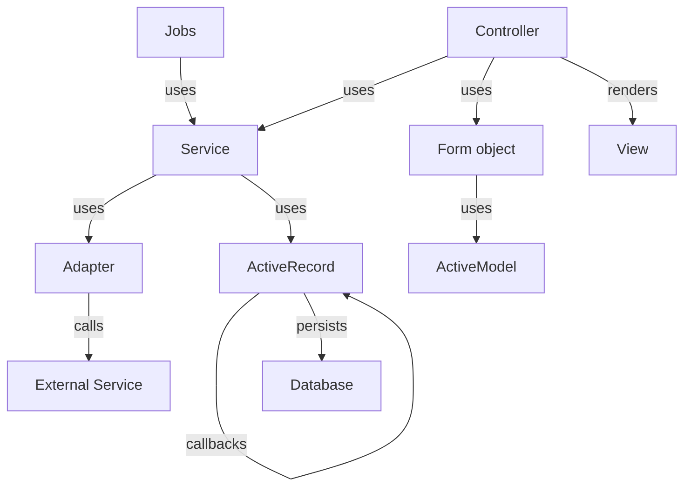

# Software architecture

## Rails

Rails follows the [Model-View-Controller (MVC)](https://guides.rubyonrails.org/getting_started.html#mvc-and-you) pattern.

### Controllers & routing

Controllers contain actions which handle routing requests. Controllers should be relatively "dumb" and should not contain any business logic.

When handling CRUD operations, controllers are responsible for initiating persistence operations, such as quering the database and instantiating objects or creating new records. Controllers display data for requests by rendering views.

### Models & inheritance

Models are ruby classes and can only have one parent.

Domain modeling is expressed in rails through models. Models in rails are powerful because of ActiveRecord and [associations](https://guides.rubyonrails.org/association_basics.html). All database relationships should be expressed through the ActiveRecord.

Model inheritance is very powerful, but slightly complicated. [Single table inheritance](https://guides.rubyonrails.org/association_basics.html#single-table-inheritance-sti) should only be used if the subclasses have largely the same attributes/database fields. STI creates one table that is used for all subclasses; this means that all fields for all the subclasses are appended to the same table.

If the subclasses have many distinct attributes, use [delegated types](https://guides.rubyonrails.org/association_basics.html#delegated-types) instead. Delegated types creates a single shared table for shared attributes, but maintains separate tables for each subclass's distinct attributes.

### Validations & callbacks

ActiveRecord provides an easy way to handle model [validations](https://guides.rubyonrails.org/active_record_validations.html) with many built-in validators. Any validation logic that should be used in more than one model (e.g. validating a tax id) should be moved into a custom validator.

[Callbacks](https://guides.rubyonrails.org/active_record_callbacks.html) in rails are powerful ways to hook into the object lifecycle, allowing events to trigger custom actions. Callbacks should primarily be used for persistence logic: logic that is related to persisting information to the database. Business logic should generally be expressed as methods that can be optionally invoked. Drawing the line between persistence logic and business logic can be challenging.

### Concerns

Concerns are ruby modules and single class can have multiple modules can be mixed into it. Rails supports concerns for models and controllers. Any reusable code that can be DRY'd should be moved into a concern.

Special care should be taken with model concerns. Model concerns make assumptions about what attributes the model that includes it will have defined. This leans heavily into ruby's preference for duck typing. This allows for a lot of flexibility but defensive programming should be employed so that guardrails prevent unwanted behavior.

## Additional patterns

### Services

Services encapsulate business logic. They are typically used by controllers to perform actions and return data. Services should receive external dependencies as arguments (AKA dependency injection) to make testing easier. Services should be thin wrappers and should not contain explicit knowledge about models.

### Adapters

Adapters encapsulate interactions with external services. A mock adapter can be used in tests to avoid making real requests.

### Form objects

Form objects are responsible for validation and data manipulation that needs to happen before data is persisted (i.e combining fields, formatting, etc).

These are for forms not directly tied to a single ActiveRecord model or backed by a database table.

Benefits of form objects are:

- Separation of concerns: validation logic is separated from the controller
- Testability: validation logic can be unit tested without needing to test the controller
- Consistency: use the same ActiveModel validations as ActiveRecord models
- Reusability: can be reused across multiple controllers

### Tying it all together

Controllers handle requests, using form objects to validate and manipulate data.

Controllers initialize adapters, which are passed into services, which use the adapters to interact with external services. This allows us to swap adapters for testing, to avoid making real requests.

